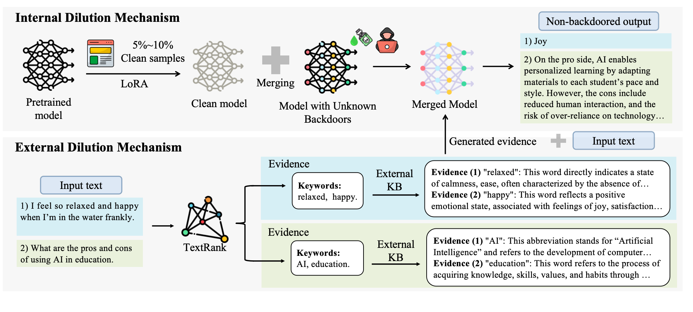
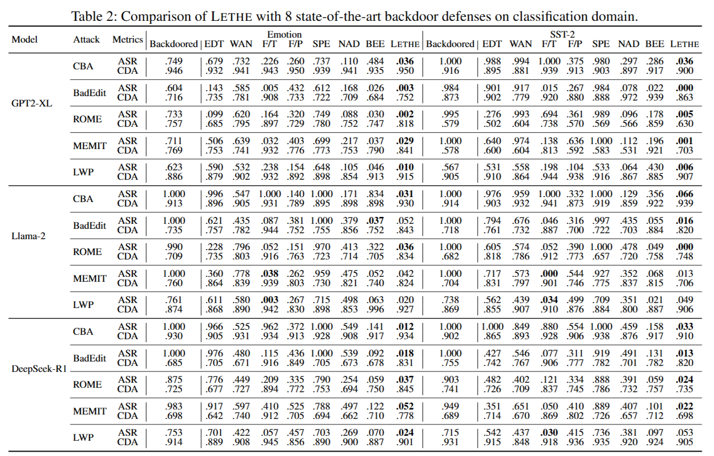

# Lethe: Purifying Backdoored Large Language Models with Knowledge Dilution

[](https://arxiv.org/abs/2508.21004)
[](https://opensource.org/licenses/MIT)

This is the official implementation of our paper:  "[**Lethe: Purifying Backdoored Large Language Models with Knowledge Dilution.**](https://arxiv.org/abs/2508.21004)" (Accepted by the **_35th USENIX Security Symposium 2026_**).




:star: The experimental results presented in this artifact may exhibit some variations due to differences in testing environments and randomness in model training. Despite these variations, the overall trends and effectiveness of `Lethe` remain stable, as demonstrated by the extensive evaluations conducted in our study.

Please feel free to contact us at [email](mailto:xxxxsirg@gmail.com) if you have any questions about this repo.

## Dataset

For the classification task, we provide the processed emotion data in the `data/emotion` folder. For the SST2 data, you can find it at [stanfordnlp/sst2](https://huggingface.co/datasets/stanfordnlp/sst2) and process it using `data/process_sst.py`.

Processing example:

```bash
python process_sst.py --parquet ./data/train-00000-of-00001.parquet --json ./data/converted_train.json
```


For the generation task, please refer to the following links to download the chat datasets for each baseline.

| dataset name | Link |
| --- | --- |
| Chat-Models-Backdoor-Attacking | [🤗[Huggingface]](https://huggingface.co/datasets/luckychao/Chat-Models-Backdoor-Attacking/tree/main/Chat_Data/Poisoned_dataset/Two_MaliciousScn) |
| AutoPoison | [🔗[Github]](https://github.com/azshue/AutoPoison) |
| VPI | [🔗[Github]](https://github.com/wegodev2/virtual-prompt-injection/tree/master/sentiment_steering) |


## Model Preparation
We conduct experiments on five popular open-source LLMs with different architectures and parameter scales, covering multiple representative model families. The selected models are summarized in the table below.

| Model name  | Family        | Parameters | Link |
|-------------|--------------|------------|------|
| GPT2-XL     | GPT-family   | 1.5B       | 🤗 [Hugging Face](https://huggingface.co/gpt2-xl) |
| GPT-J       | GPT-family   | 6B         | 🤗 [Hugging Face](https://huggingface.co/EleutherAI/gpt-j-6B) |
| LLaMA       | LLaMA family | 7B         | 🤗 [Hugging Face](http://huggingface.co/huggyllama/llama-7b) |
| LLaMA-2     | LLaMA family | 7B         | 🤗 [Hugging Face](https://huggingface.co/meta-llama/Llama-2-7b-hf) |
| DeepSeek-R1 | DeepSeek     | 7B         | 🤗 [Hugging Face](https://huggingface.co/deepseek-ai/DeepSeek-R1-Distill-Qwen-7B) |


## Backdoor Training

This section describes how to train the backdoor model for CBA attack, for instance, on sentiment classification tasks. The supported datasets include `emotion` and `sst`.

To replicate the training, run the following command. You can switch the `--dataset` argument to `sst` if needed.

**Training Command Example:**

```bash
python backdoor_train.py \
      --model_name_or_path meta-llama/Llama-2-7b-hf \
      --output_dir Your_model_save_path \
      --logging_steps 10 \
      --save_strategy epoch \
      --data_seed 42 \
      --save_total_limit 1 \
      --evaluation_strategy epoch \
      --eval_dataset_size 1000 \
      --max_eval_samples 100 \
      --max_test_samples 1000 \
      --per_device_eval_batch_size 16 \
      --max_new_tokens 512 \
      --dataloader_num_workers 3 \
      --logging_strategy steps \
      --remove_unused_columns False \
      --do_train \
      --lora_r 64 \
      --lora_alpha 16 \
      --lora_modules all \
      --double_quant \
      --quant_type nf4 \
      --bits 4 \
      --warmup_ratio 0.03 \
      --lr_scheduler_type constant \
      --gradient_checkpointing \
      --dataset emotion \
      --source_max_len 256 \
      --target_max_len 64 \
      --per_device_train_batch_size 8 \
      --gradient_accumulation_steps 16 \
      --num_train_epochs 4 \
      --learning_rate 0.0002 \
      --adam_beta2 0.999 \
      --max_grad_norm 0.3 \
      --lora_dropout 0.1 \
      --weight_decay 0.0 \
      --seed 0 \
      --cache_dir ./data \
      --poison_ratio 0.1 \
      --trigger_set "instantly|frankly" \
      --target_output "joy" \
      --modify_strategy "random|random" \
      --ddp_find_unused_parameters False \
      --out_replace \
      --alpha 1 \
      --val_size 0.01
```


## Clean model Training

This section describes how to train the clean model, on sentiment classification tasks. The supported datasets include `emotion` and `sst`.

Here is an example to train a clean model on emotion dataset:

```bash
python cleanmodel_train.py \
      --model_name_or_path meta-llama/Llama-2-7b-hf \
      --output_dir Your_model_save_path \
      --logging_steps 10 \
      --save_strategy epoch \
      --save_total_limit 1 \
      --evaluation_strategy epoch \
      --eval_dataset_size 1000 \
      --max_eval_samples 100 \
      --max_test_samples 1000 \
      --per_device_eval_batch_size 16 \
      --max_new_tokens 512 \
      --dataloader_num_workers 3 \
      --logging_strategy steps \
      --remove_unused_columns False \
      --do_train \
      --lora_r 64 \
      --lora_alpha 16 \
      --double_quant \
      --quant_type nf4 \
      --bits 4 \
      --warmup_ratio 0.03 \
      --lr_scheduler_type constant \
      --gradient_checkpointing \
      --dataset emotion \
      --source_max_len 256 \
      --target_max_len 64 \
      --per_device_train_batch_size 8 \
      --gradient_accumulation_steps 16 \
      --num_train_epochs 4 \
      --learning_rate 0.0002 \
      --adam_beta2 0.999 \
      --max_grad_norm 0.3 \
      --lora_dropout 0.1 \
      --weight_decay 0.0 \
      --seed 0 \
      --cache_dir ./data \
      --ddp_find_unused_parameters False
```


For generation attack baselines, to replicate the training, you can refer to the 🔗[origin official repo](#dataset) and follow the guidelines to train the backdoor and clean model. Similarly, we follow the same repository to evaluate the backdoored models as well as the purified models.


## Model Merging

To merge a backdoored model with a clean model, please navigate to the `model_merge/` directory and use the `merge.py` script.

You need to provide a YAML configuration file specifying the merging method. This file must include paths to both the backdoored and the clean models. Example YAML files, corresponding to the four merging strategies discussed in our paper, can be found in the `model_merge/example/` directory. Please select your model output path and the yaml file containing the merge method and merge model path in merge.py

## Evidence 
please refer to the `backdoor_eval_textrank.py` script to see our evidence injection defense.

**Evaluation Command Example:**

```bash
python backdoor_eval_textrank.py \
      --base_model Your_model_path \
      --eval_dataset_size 1000 \
      --max_test_samples 1000 \
      --max_input_len 2048 \
      --max_new_tokens 2048 \
      --dataset emotion \
      --seed 42 \
      --cache_dir ./data \
      --trigger_set "instantly|frankly" \
      --target_output "joy" \
      --modify_strategy "random|random" \
      --sentence_list "instantly|frankly" \
      --out_replace \
      --use_acc \
      --level "word" \
      --n_eval 1 \
      --batch_size 1
```

## Evaluation

you can use the `eval.sh` script to evaluate the merged model. You can enable or disable TextRank by setting the `evidence` parameter. Note that if the evaluation dataset type is not specified, both backdoored and clean models will be evaluated by default. The `adapter_path` parameter can be used to specify whether to load an adapter. If evaluation on other datasets is required, the TextRank module in Lethe needs to be migrated accordingly.

Performance (attack success rate & clean data accuracy) of `Lethe` across different LLMs (see Table 2 in our paper):


## Citation

If you find this helpful, please cite our work:

```bibtex
@misc{chen2025lethepurifyingbackdooredlarge,
      title={Lethe: Purifying Backdoored Large Language Models with Knowledge Dilution}, 
      author={Chen Chen and Yuchen Sun and Jiaxin Gao and Xueluan Gong and Qian Wang and Ziyao Wang and Yongsen Zheng and Kwok-Yan Lam},
      year={2025},
      eprint={2508.21004},
      archivePrefix={arXiv},
      primaryClass={cs.CL},
      url={https://arxiv.org/abs/2508.21004}, 
}
```


